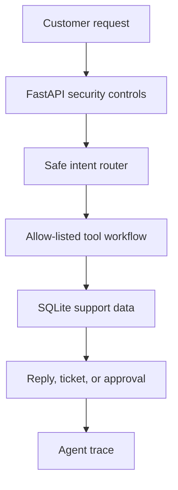

# Agentic Customer Support

[](https://github.com/krishna-theja-nooka/agentic-customer-support/actions/workflows/ci.yml)

A Python-first, production-minded customer-support agent that routes requests through bounded tools, requires human approval for refunds, and records an auditable trace for every workflow.

> The goal is not to give an LLM unrestricted business authority. The goal is to build a reliable control plane around an LLM-capable agent.

## What this demonstrates

- Intent routing and approved multi-step workflows
- Tool calling with a restricted tool catalog
- Human-in-the-loop approval for refund requests
- Support-ticket escalation when automation should stop
- API-key authentication, rate limiting, and trace records
- Prompt-injection rejection before business tools run
- Deterministic agent evaluations and GitHub Actions CI

## Architecture



Read the [architecture guide](docs/ARCHITECTURE.md) and [security model](docs/SECURITY.md) for the reasoning behind the controls.

## Supported workflows

| Customer request | Agent action | Result |
| --- | --- | --- |
| “Where is my order?” | Looks up customer and latest order | Safe status response |
| “I want a refund” | Verifies customer/order and creates approval request | Refund remains pending human review |
| “I need a human agent” | Creates a high-priority support ticket | Escalated to support |
| Prompt injection or unknown workflow | Rejects safely | No business tool runs |

## Quick start (Windows PowerShell)

```powershell
git clone https://github.com/krishna-theja-nooka/agentic-customer-support.git
cd agentic-customer-support
py -3.12 -m venv .venv
.\.venv\Scripts\python.exe -m pip install --upgrade pip
.\.venv\Scripts\python.exe -m pip install -r requirements.lock
.\.venv\Scripts\python.exe -m pip install --no-deps -e .
.\.venv\Scripts\python.exe -m agentic_customer_support init-env
.\.venv\Scripts\python.exe -m agentic_customer_support seed
```

If PowerShell blocks virtual-environment activation, simply keep using `.\.venv\Scripts\python.exe`; activation is optional.

Run a support workflow:

```powershell
.\.venv\Scripts\python.exe -m agentic_customer_support ask ava@example.com "I want a refund for my order"
```

The response includes a trace ID, selected intent, tool steps, and an approval ID. Refunds do not execute automatically.

Start the API:

```powershell
.\.venv\Scripts\python.exe -m agentic_customer_support serve
```

Open `http://127.0.0.1:8000/docs`. Use the `SUPPORT_AGENT_API_KEY` from your local `.env` file as the `x-api-key` header.

## API workflow

1. `POST /v1/support` with a customer email and message.
2. For a refund, store the returned `approval_id`.
3. A human reviewer calls `POST /v1/approvals/{approval_id}` with an approval decision.
4. Inspect agent execution evidence at `GET /v1/traces/{trace_id}`.

## Quality checks

```powershell
.\.venv\Scripts\python.exe -m ruff check .
.\.venv\Scripts\python.exe -m ruff format --check .
.\.venv\Scripts\python.exe -m pytest -q
.\.venv\Scripts\python.exe -m agentic_customer_support evaluate --output reports/evaluation.json
```

CI runs checks on Python 3.11 and 3.12, then uploads the evaluation report.

## Project structure

```text
src/agentic_customer_support/   API, agent workflow, tools, traces, CLI
tests/                          Unit tests
eval/                           Deterministic agent evaluation cases
docs/                           Architecture, security, and evaluation notes
data/                           Synthetic data documentation
.github/workflows/             GitHub Actions CI
```

## Production roadmap

1. Introduce an LLM only as a structured intent extractor behind the existing allow-list.
2. Add verified customer sessions and account-level authorization.
3. Integrate a real ticketing system and payment provider with idempotency controls.
4. Send traces, cost, latency, tool-error, and escalation metrics to observability tooling.
5. Add red-team, prompt-injection, authorization, and regression evaluation suites.

## Data and security

All records are fictional. Do not commit `.env`, customer information, payment credentials, or production connection strings. See [SECURITY.md](docs/SECURITY.md).

## License

MIT. See [LICENSE](LICENSE).
