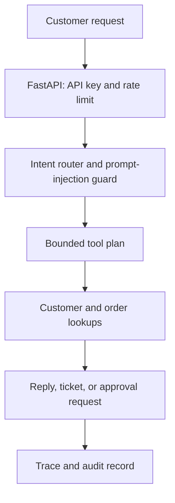

# Architecture

The agent has a restricted control plane. It can classify a request into a small approved intent catalog, then invoke only the tools allowed for that intent.

## Approved workflows

| Intent | Allowed tools | Outcome |
| --- | --- | --- |
| Order status | customer lookup, order lookup | Customer-safe status response |
| Billing question | customer lookup, order lookup | Transaction summary |
| Refund request | customer lookup, order lookup, approval request | Pending human approval |
| Human escalation | customer lookup, ticket creation | Routed support ticket |

An LLM may later produce a typed intent and arguments, but it must never receive direct authority to call unapproved tools, issue refunds, or bypass the approval gate.
